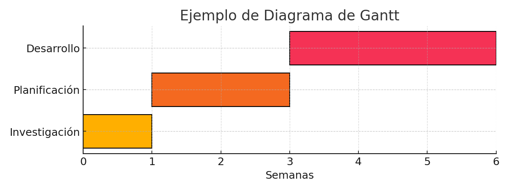

# Generador de Diagrama de Gantt

Este proyecto en Python genera un diagrama de Gantt en formato PNG a partir de datos introducidos por el usuario. Es ideal para planificar proyectos de forma visual y sencilla.

## 🎯 Características

- Entrada interactiva por consola
- Validación de errores de entrada
- Colores personalizados en la consola
- Generación automática del gráfico en PNG
- Compatible con Windows, Linux y macOS

## 📦 Requisitos

- Python 3.7+
- matplotlib
- colorama

Instalación de dependencias:

```bash
pip install -r requirements.txt
```

## ▶️ Cómo usar

1. Ejecuta el script desde la terminal:

```bash
python gantt_generator.py
```

2. Introduce los datos del proyecto cuando se soliciten:
   - Número de etapas
   - Nombre de cada etapa
   - Semana de inicio y de fin
   - Nombre del archivo de salida

3. El diagrama se guarda automáticamente como imagen `.png`.

## 🖼️ Ejemplo



```
=======================================
    GENERADOR DE DIAGRAMA DE GANTT
=======================================

¿Cuántas etapas tiene el proyecto?: 3

Nombre de la etapa 1: Investigación
Semana de inicio de 'Investigación': 1
Semana de fin de 'Investigación': 2
----------------------------------------
...

Nombre del archivo de salida (sin extensión): mi_proyecto
```

El archivo `mi_proyecto.png` se genera en el mismo directorio.

## 📄 Licencia

Este proyecto se distribuye bajo la licencia MIT.
